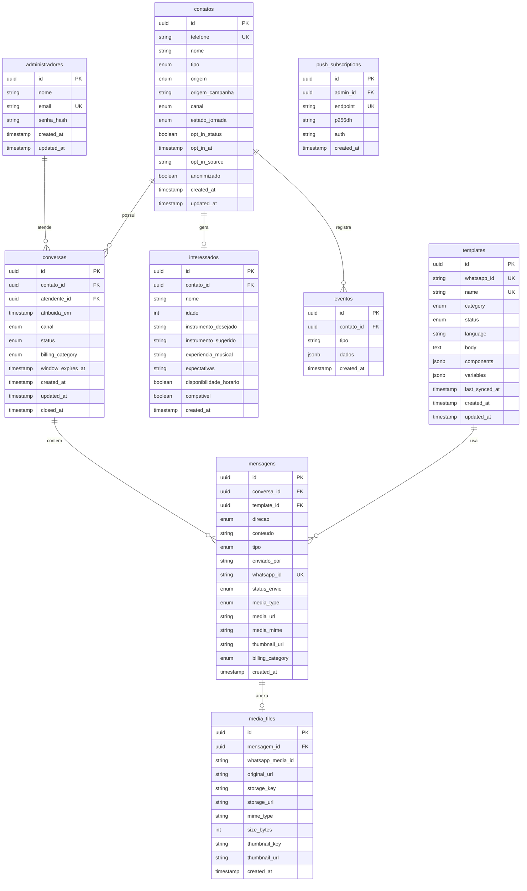

# Data Model: Atendimento Compartilhado e Mídia

**Extends**: 1-crm-omnichannel-mvp/data-model.md

## ER Diagram (Mermaid)



## New/Modified Tables

### contatos (Modified)

| Column | Type | Description | New? |
|--------|------|-------------|------|
| opt_in_status | BOOLEAN | LGPD consent status | ✅ |
| opt_in_at | TIMESTAMP | When consent was given | ✅ |
| opt_in_source | VARCHAR(50) | 'whatsapp_first_message', 'form', etc | ✅ |
| anonimizado | BOOLEAN | If data was anonymized (LGPD) | ✅ |

### conversas (Modified)

| Column | Type | Description | New? |
|--------|------|-------------|------|
| atendente_id | UUID FK | Assigned admin (nullable) | ✅ |
| atribuida_em | TIMESTAMP | When assigned | ✅ |
| billing_category | ENUM | 'service', 'utility', 'marketing' | ✅ |
| window_expires_at | TIMESTAMP | When 24h window closes | ✅ |

### mensagens (Modified)

| Column | Type | Description | New? |
|--------|------|-------------|------|
| template_id | UUID FK | If sent via template | ✅ |
| media_type | ENUM | 'image', 'audio', 'document', 'video', 'location', null | ✅ |
| media_url | TEXT | URL in object storage | ✅ |
| media_mime | VARCHAR(100) | MIME type | ✅ |
| thumbnail_url | TEXT | Thumbnail URL (images) | ✅ |
| billing_category | ENUM | Category for cost tracking | ✅ |

### media_files (New)

Stores metadata about downloaded/uploaded media files.

| Column | Type | Description |
|--------|------|-------------|
| id | UUID PK | Primary key |
| mensagem_id | UUID FK | Related message |
| whatsapp_media_id | VARCHAR(100) | ID from WhatsApp API |
| original_url | TEXT | Temporary WhatsApp URL |
| storage_key | VARCHAR(255) | S3/MinIO key |
| storage_url | TEXT | Permanent storage URL |
| mime_type | VARCHAR(100) | e.g., 'image/jpeg' |
| size_bytes | INTEGER | File size |
| thumbnail_key | VARCHAR(255) | Thumbnail S3 key (images) |
| thumbnail_url | TEXT | Thumbnail URL |
| created_at | TIMESTAMP | Upload timestamp |

### templates (New)

WhatsApp approved message templates.

| Column | Type | Description |
|--------|------|-------------|
| id | UUID PK | Primary key |
| whatsapp_id | VARCHAR(100) UK | ID from WhatsApp API |
| name | VARCHAR(100) UK | Template name |
| category | ENUM | 'utility', 'marketing', 'authentication' |
| status | ENUM | 'approved', 'pending', 'rejected' |
| language | VARCHAR(10) | e.g., 'pt_BR' |
| body | TEXT | Template body text |
| components | JSONB | Header, body, footer, buttons |
| variables | JSONB | Array of variable definitions |
| last_synced_at | TIMESTAMP | Last sync from WhatsApp |
| created_at | TIMESTAMP | Created |
| updated_at | TIMESTAMP | Updated |

### push_subscriptions (New)

Web Push notification subscriptions.

| Column | Type | Description |
|--------|------|-------------|
| id | UUID PK | Primary key |
| admin_id | UUID FK | Admin user |
| endpoint | TEXT UK | Push endpoint URL |
| p256dh | TEXT | Public key |
| auth | TEXT | Auth secret |
| created_at | TIMESTAMP | Subscription date |

## Enums (New/Updated)

```sql
-- New
CREATE TYPE media_type AS ENUM ('image', 'audio', 'document', 'video', 'location');
CREATE TYPE template_category AS ENUM ('utility', 'marketing', 'authentication');
CREATE TYPE template_status AS ENUM ('approved', 'pending', 'rejected');
CREATE TYPE billing_category AS ENUM ('service', 'utility', 'marketing', 'authentication');

-- Updated (add to existing)
ALTER TYPE tipo_mensagem ADD VALUE 'template';
ALTER TYPE tipo_mensagem ADD VALUE 'media';
```

## Indexes (New)

```sql
-- Conversation assignment lookups
CREATE INDEX idx_conversas_atendente ON conversas(atendente_id) WHERE atendente_id IS NOT NULL;
CREATE INDEX idx_conversas_window ON conversas(window_expires_at) WHERE status = 'ativa';

-- Media lookups
CREATE INDEX idx_media_files_mensagem ON media_files(mensagem_id);
CREATE UNIQUE INDEX idx_media_files_whatsapp ON media_files(whatsapp_media_id);

-- Template lookups
CREATE INDEX idx_templates_category ON templates(category) WHERE status = 'approved';

-- Push subscriptions
CREATE INDEX idx_push_admin ON push_subscriptions(admin_id);
```

## Window State Machine

```
                    ┌─────────────────┐
                    │  JANELA_ABERTA  │
                    │                 │
    Cliente msg     │  - Texto livre  │
    ───────────────►│  - Mídia        │
                    │  - Templates    │
                    │  - Gratuito     │
                    └────────┬────────┘
                             │
                             │ 24h timeout
                             ▼
                    ┌─────────────────┐
                    │ JANELA_FECHADA  │
                    │                 │
                    │  - SÓ templates │
    Template sent   │  - Cobrado      │
    ───────────────►│                 │
                    └────────┬────────┘
                             │
                             │ Reabre janela
                             ▼
                    ┌─────────────────┐
                    │  JANELA_ABERTA  │
                    └─────────────────┘
```

## Media Flow

```
[WhatsApp] ──webhook──► [API]
                          │
                          ▼
                    [Queue: media:download]
                          │
                          ▼
                    [Worker]
                    │   1. GET /media/{id} from Graph API
                    │   2. Download binary stream
                    │   3. Upload to MinIO/S3
                    │   4. Generate thumbnail (if image)
                    │   5. Save MediaFile record
                    │   6. Update Message with media_url
                          │
                          ▼
                    [WebSocket: message:updated]
                          │
                          ▼
                    [Frontend: Show media]
```
